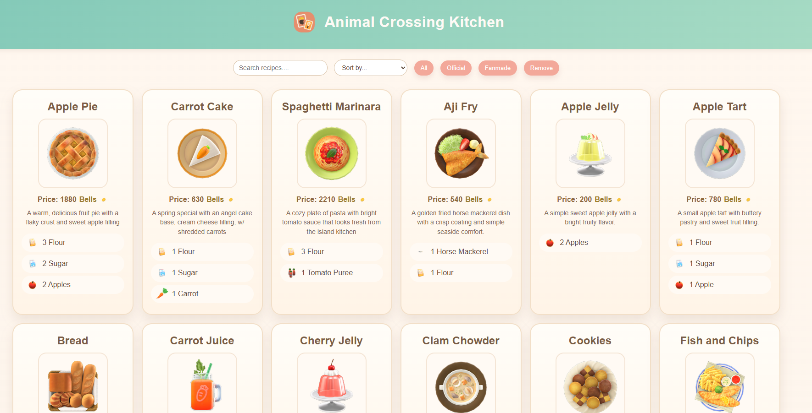
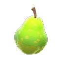
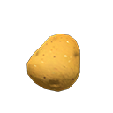

# 👨‍🍳 Animal Crossing Kitchen 

Hello! This is my Stage 2 project assessment submission for the **Snap Engineering Academy (SEA)**

It's an **open-source** catalog website inspired by Animal Crossing recipes especially from New Horizons! (I am currently addicted to the game...). In the site, it shows the recipe cards with their ingredients, bell price, and small/short descriptions of the food. There are also fanmade entries too! My favorite are the HTML, CSS, JS cookies along with the Snapchat mascot!  ❤️ 

 ``` I do not own Animal Crossing: New Horizons or any of its original characters, designs, names, or in-game content. All related intellectual property belongs to Nintendo. ```




##⭐ Project Highlights

- Displays Animal Crossing-inspired recipe cards with images
- Shows ingredient lists with matching ingredient icons
- Includes fanmade recipe entries with their own images and descriptions
- Lets users search recipes by name
- Lets users sort recipes by name or by price
- Includes a remove feature to remove the last displayed card


### 🍽️ Recipe and ingredient examples 








## ⭐ Features

### Search

Users can search for recipes by typing into the search bar. The site filters recipe cards by recipe name in real time.

### Sorting

Users can sort the displayed recipes by:

- Name: A to Z
- Price: Low to High
- Price: High to Low

### Remove

Users can remove the last displayed recipe card from the page using the remove button.

### Fanmade entries

The site supports fanmade recipes by marking them in the JSON data with:

```json
"section": "fanmade"
```

This makes it possible to separate custom entries from official-style ones.

## 🗂️ Data Structure Used

This project uses:

- An array to store all recipe entries
- Objects for each recipe
- A nested array of ingredient objects inside each recipe

This structure was a good fit because:

- Arrays make it easy to loop through all recipes and display them as cards
- Objects keep each recipe's data grouped together in one place
- Nested ingredient objects make it easy to store both the ingredient label and ingredient image
- The structure supports features like searching, sorting, filtering, and rendering images without needing separate datasets

Example recipe object:

```json
{
  "name": "Apple Pie",
  "image": "assets/recipes/apple-pie.png",
  "price": 1880,
  "description": "A warm, delicious fruit pie with a flaky crust and sweet apple filling",
  "section": "official",
  "ingredients": [
    {
      "label": "3 Flour",
      "image": "assets/ingredients/flour.png"
    },
    {
      "label": "2 Sugar",
      "image": "assets/ingredients/sugar.png"
    }
  ]
}
```

## 📝 Editing the JSON Data

All recipe data is stored in [data/recipes.json](./data/recipes.json).

Each recipe entry should include:

- `name`
- `image`
- `price`
- `description`
- `section`
- `ingredients`

Each ingredient inside `ingredients` should include:

- `label`
- `image`

Example:

```json
{
  "name": "Macarons",
  "image": "assets/recipes/macarons.png",
  "price": 950,
  "description": "A colorful plate of delicate sandwich cookies with a sweet filling.",
  "section": "fanmade",
  "ingredients": [
    {
      "label": "2 Flour",
      "image": "assets/ingredients/flour.png"
    },
    {
      "label": "2 Sugar",
      "image": "assets/ingredients/sugar.png"
    }
  ]
}
```

When editing `recipes.json`:

1. Make sure each recipe object is separated by commas.
2. Keep all text inside double quotes.
3. Make sure image paths match the actual files inside `assets/recipes` or `assets/ingredients`.
4. Use `"section": "fanmade"` for custom entries you created.
5. Use `"section": "official"` for official-style entries if you want the filters to work clearly.

## 🗂️ File Structure

```text
ACNH-CatalogWebsite/
|-- assets/
|   |-- bell-coin.png
|   |-- recipe-card.png
|   |-- ingredients/
|   |   |-- flour.png
|   |   |-- sugar.png
|   |   |-- tomato-puree.png
|   |   `-- ...
|   `-- recipes/
|       |-- apple-pie.png
|       |-- carrot-cake.png
|       |-- spaghetti-marinara.png
|       `-- ...
|-- data/
|   `-- recipes.json
|-- index.html
|-- scripts.js
|-- style.css
|-- LICENSE
`-- README.md
```

## ⭐How It Works

- [index.html](./index.html) contains the page structure, search bar, buttons, and card template.
- [style.css](./style.css) controls the cozy visual styling for the page and cards.
- [scripts.js](./scripts.js) loads the JSON data, renders cards, and handles searching, sorting, filtering, and removing cards.
- [data/recipes.json](./data/recipes.json) stores all recipe and ingredient data.

## Running the Project

1. Clone or download this repository.
2. Open the project in VS Code or another editor.
3. Run it with a local server such as Live Server.

Using a local server (like the Live Server VS Code extension) is recommended because the project loads `recipes.json` with JavaScript.

## ❤️  Contributing

This project can also be continued as a small open source project.

Ways to contribute:

- Add more official Animal Crossing recipes
- Add more fanmade recipes
- Improve the card design
- Add better filtering categories
- Improve accessibility with clearer alt text and keyboard support
- Fix bugs in rendering, search, or sorting

### Contribution steps

1. Fork the repository.
2. Create a new branch for your change.
3. Make your updates.
4. Test the site locally.
5. Open a pull request with a short explanation of your changes.

### Contribution tips for recipe data

If you are contributing recipes:

- Add the new image files to `assets/recipes/` or `assets/ingredients/`
- Add the matching entry to `data/recipes.json`
- Double-check that the image filenames and JSON paths match exactly
- Keep descriptions short so cards stay readable

